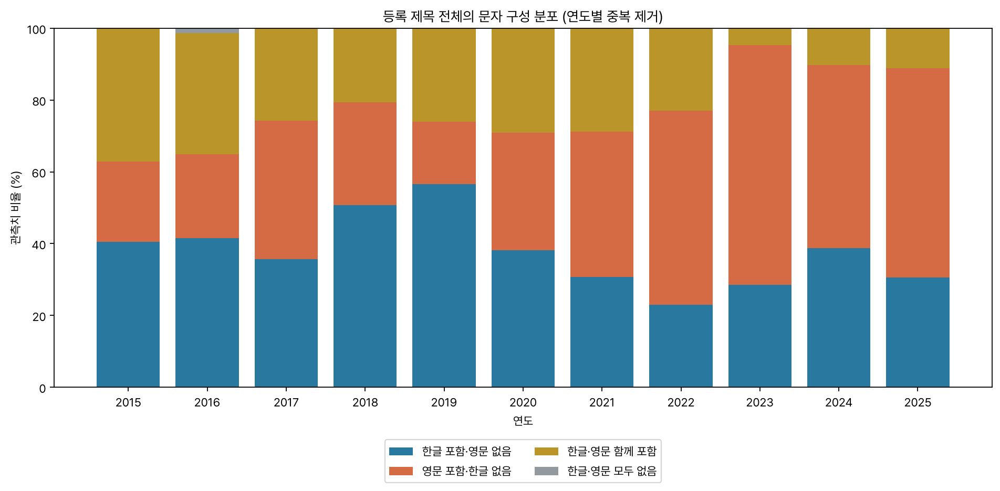
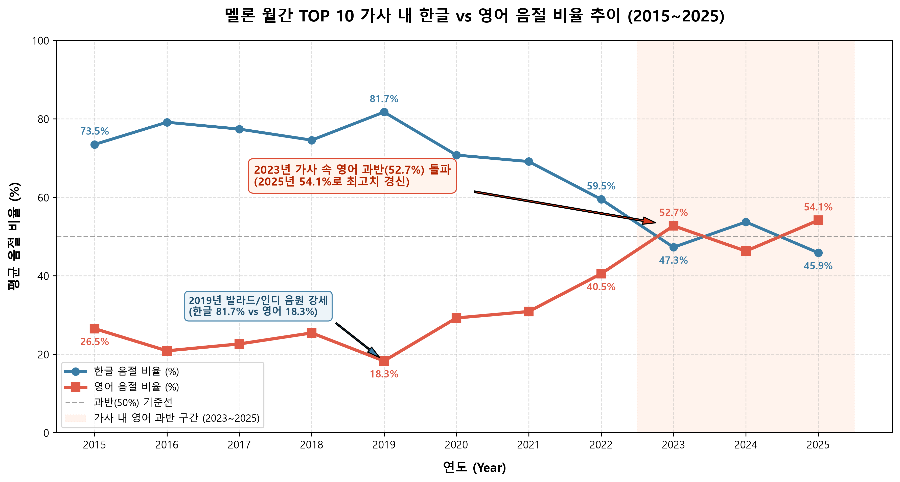
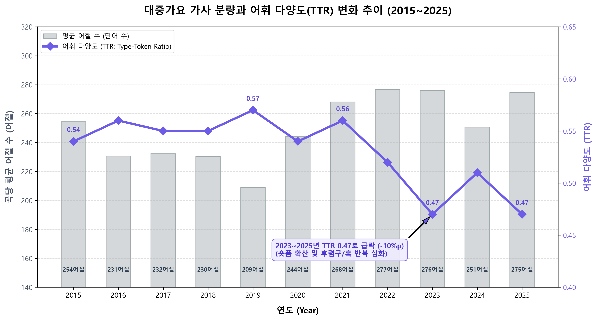

# 분석 결과

이 문서의 표와 그림은 원 분석 650행을 기준으로 작성했습니다. 저작권을 고려해 공개한 곡별 CSV는 260행(2/5)이므로, 공개본만으로 재계산한 수치는 아래 전체 결과와 다를 수 있습니다. 비율은 원 분석의 해당 연도 관측치 수를 분모로 하며, 반올림으로 유형별 비율 합계가 100.0%와 조금 다를 수 있습니다. 분석 단위와 산식은 [METHODS.md](METHODS.md)에 설명했습니다.

## 등록 제목 유형

유형은 등록 제목 문자열에 `[가-힣]`과 `[A-Za-z]`가 있는지를 기준으로 합니다. 표의 각 셀은 `건수 (연도 내 비율)`입니다.

| 연도 | n | 한글 포함·영문 없음 | 영문 포함·한글 없음 | 한글·영문 함께 포함 | 한글·영문 모두 없음 |
| --- | ---: | ---: | ---: | ---: | ---: |
| 2015 | 89 | 36 (40.4%) | 20 (22.5%) | 33 (37.1%) | 0 (0.0%) |
| 2016 | 77 | 32 (41.6%) | 18 (23.4%) | 26 (33.8%) | 1 (1.3%) |
| 2017 | 70 | 25 (35.7%) | 27 (38.6%) | 18 (25.7%) | 0 (0.0%) |
| 2018 | 63 | 32 (50.8%) | 18 (28.6%) | 13 (20.6%) | 0 (0.0%) |
| 2019 | 69 | 39 (56.5%) | 12 (17.4%) | 18 (26.1%) | 0 (0.0%) |
| 2020 | 55 | 21 (38.2%) | 18 (32.7%) | 16 (29.1%) | 0 (0.0%) |
| 2021 | 52 | 16 (30.8%) | 21 (40.4%) | 15 (28.8%) | 0 (0.0%) |
| 2022 | 48 | 11 (22.9%) | 26 (54.2%) | 11 (22.9%) | 0 (0.0%) |
| 2023 | 42 | 12 (28.6%) | 28 (66.7%) | 2 (4.8%) | 0 (0.0%) |
| 2024 | 49 | 19 (38.8%) | 25 (51.0%) | 5 (10.2%) | 0 (0.0%) |
| 2025 | 36 | 11 (30.6%) | 21 (58.3%) | 4 (11.1%) | 0 (0.0%) |

2015년 영문 포함·한글 없음 유형은 20/89건(22.5%), 2025년은 21/36건(58.3%)입니다. 연도별 비율은 매년 같은 방향으로 움직이지 않았으며, 2023년 66.7%, 2024년 51.0%, 2025년 58.3%입니다.

## 가사 문자·공백 구분 지표

가사 원문은 공개하지 않습니다. 아래 수치는 원 분석 650행의 곡별 수치에서 계산한 기술통계입니다. “영문 미포함”은 영문 알파벳 수가 0인 관측치이고, “50% 이상”은 저장된 곡별 영문 문자 비율이 50.00 이상인 관측치입니다. TTR은 소문자 공백 구분 문자열 기준입니다.

| 연도 | n | 평균 영문 문자 비율 | 영문 미포함 n (%) | 영문 비율 50% 이상 n (%) | 평균 공백 구분 단위 수 | 평균 TTR |
| --- | ---: | ---: | ---: | ---: | ---: | ---: |
| 2015 | 89 | 26.53% | 21 (23.60%) | 19 (21.35%) | 254.47 | 0.5400 |
| 2016 | 77 | 20.87% | 19 (24.68%) | 7 (9.09%) | 230.65 | 0.5629 |
| 2017 | 70 | 22.62% | 19 (27.14%) | 10 (14.29%) | 232.27 | 0.5534 |
| 2018 | 63 | 25.43% | 18 (28.57%) | 15 (23.81%) | 230.38 | 0.5518 |
| 2019 | 69 | 18.28% | 35 (50.72%) | 10 (14.49%) | 209.03 | 0.5731 |
| 2020 | 55 | 29.24% | 18 (32.73%) | 12 (21.82%) | 244.16 | 0.5397 |
| 2021 | 52 | 30.89% | 15 (28.85%) | 15 (28.85%) | 268.04 | 0.5550 |
| 2022 | 48 | 40.51% | 10 (20.83%) | 23 (47.92%) | 276.83 | 0.5176 |
| 2023 | 42 | 52.73% | 7 (16.67%) | 26 (61.90%) | 276.00 | 0.4657 |
| 2024 | 49 | 46.29% | 9 (18.37%) | 25 (51.02%) | 250.63 | 0.5116 |
| 2025 | 36 | 54.14% | 10 (27.78%) | 22 (61.11%) | 274.75 | 0.4731 |

평균 영문 문자 비율은 2015년 26.53%, 2025년 54.14%로, 표의 두 값을 뺀 차이는 27.61%p입니다. 이는 각 곡-연도 관측치의 저장된 비율을 같은 가중치로 평균한 차이입니다.

## 참여자 표기 제거 민감도

민감도 CSV에는 제목 문자열이 바뀐 106건이 기록되어 있고, 그중 유형 분류가 바뀐 건은 75건입니다. 아래 비율은 전체 해당 연도 관측치를 분모로 계산했습니다.

| 연도 | n | 영문 포함·한글 없음: 등록 제목 | 참여자 표기 제거 후 | 한글·영문 함께 포함: 등록 제목 | 참여자 표기 제거 후 |
| --- | ---: | ---: | ---: | ---: | ---: |
| 2015 | 89 | 20/89 (22.5%) | 25/89 (28.1%) | 33/89 (37.1%) | 13/89 (14.6%) |
| 2016 | 77 | 18/77 (23.4%) | 22/77 (28.6%) | 26/77 (33.8%) | 9/77 (11.7%) |
| 2017 | 70 | 27/70 (38.6%) | 27/70 (38.6%) | 18/70 (25.7%) | 9/70 (12.9%) |
| 2018 | 63 | 18/63 (28.6%) | 20/63 (31.7%) | 13/63 (20.6%) | 8/63 (12.7%) |
| 2019 | 69 | 12/69 (17.4%) | 12/69 (17.4%) | 18/69 (26.1%) | 10/69 (14.5%) |
| 2020 | 55 | 18/55 (32.7%) | 19/55 (34.5%) | 16/55 (29.1%) | 15/55 (27.3%) |
| 2021 | 52 | 21/52 (40.4%) | 22/52 (42.3%) | 15/52 (28.8%) | 9/52 (17.3%) |
| 2022 | 48 | 26/48 (54.2%) | 27/48 (56.2%) | 11/48 (22.9%) | 5/48 (10.4%) |
| 2023 | 42 | 28/42 (66.7%) | 28/42 (66.7%) | 2/42 (4.8%) | 1/42 (2.4%) |
| 2024 | 49 | 25/49 (51.0%) | 26/49 (53.1%) | 5/49 (10.2%) | 4/49 (8.2%) |
| 2025 | 36 | 21/36 (58.3%) | 22/36 (61.1%) | 4/36 (11.1%) | 3/36 (8.3%) |

이 비교는 지정된 참여자 표기만 제한적으로 제거한 민감도 분석입니다. 분류 변화가 작품 본제목의 확정 분류를 뜻하지는 않습니다.
